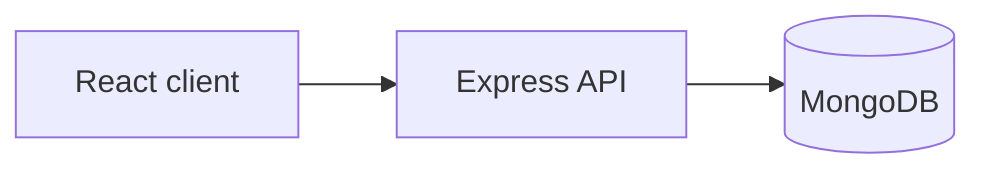

# SUNi — Make Your Day Shining

Full-stack lifestyle e-commerce (MERN + TypeScript). Side project by [LouisLi1020](https://github.com/LouisLi1020).

**Repository:** https://github.com/LouisLi1020/SUNi-Make-Your-Day-Shining

[](https://github.com/LouisLi1020/SUNi-Make-Your-Day-Shining/actions/workflows/ci.yml)

---

## What works today

| Area | Status | Notes |
|------|--------|--------|
| Backend API | ✅ | Auth, products, cart, checkout routes (MongoDB) |
| Frontend UI | 🚧 | Figma-based pages; some flows still on mock data |
| AWS deploy | ⏸ | Previously targeted; **no live server** (university credits ended) |
| CI / tests | ✅ | GitHub Actions — server tests + client build |

> Add screenshots under `docs/assets/screenshots/` and embed here when captured locally.

---

## Quick start (local)

**Prerequisites:** Node 18+, MongoDB (or `docker-compose up -d`)

```bash
git clone https://github.com/LouisLi1020/SUNi-Make-Your-Day-Shining.git
cd SUNi-Make-Your-Day-Shining

# Backend
cd server && cp env.example .env && npm install && npm run dev

# Frontend (new terminal)
cd client && npm install && npm run dev
```

- API: http://localhost:5000 — health: `/health`  
- See [docs/DEVELOPMENT_SETUP.md](docs/DEVELOPMENT_SETUP.md) for details.

---

## Architecture



Full diagram: [docs/ARCHITECTURE.md](docs/ARCHITECTURE.md) · Deployment: [docs/DEPLOYMENT.md](docs/DEPLOYMENT.md)

---

## Tech stack

- **Client:** React 18, TypeScript, Vite, Tailwind, Zustand  
- **Server:** Node, Express, Mongoose, JWT, Stripe (configured via env)  
- **Ops:** Docker Compose (dev), GitHub Actions (CI)

---

## Engineering documentation

| Topic | In this repo | Extended notes |
|-------|----------------|----------------|
| Security | [docs/security/sunishop-security.md](docs/security/sunishop-security.md) | [Learning log — security](https://github.com/LouisLi1020/43030-learning-log/blob/main/docs/sunishop/security.md) |
| Architecture | [docs/ARCHITECTURE.md](docs/ARCHITECTURE.md) | [Learning log — architecture](https://github.com/LouisLi1020/43030-learning-log/blob/main/docs/sunishop/architecture.md) |
| CI / tests | [.github/workflows/ci.yml](.github/workflows/ci.yml) | [Learning log — CI](https://github.com/LouisLi1020/43030-learning-log/blob/main/docs/sunishop/ci-and-testing.md) |

*Last engineering update: May 2026.*

---

## Contributing

See [CONTRIBUTING.md](CONTRIBUTING.md).

## License

MIT
