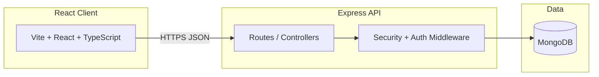

# System architecture

## Layers

| Layer | Technology | Responsibility |
|-------|------------|----------------|
| Presentation | React 18, Tailwind, Zustand | Storefront UI, admin pages |
| API | Express, TypeScript | Auth, products, cart, checkout |
| Security | Custom middleware + JWT | Validation, rate limits, RBAC |
| Persistence | Mongoose / MongoDB | Users, products, orders |

## Multi-role access

- **Public:** product catalog, search  
- **Member:** profile, cart, checkout (API routes behind `authenticate`)  
- **Admin:** product CRUD (`requireAdmin`)

## 43030 alignment (G4 narrative)

Trade-off example: **monolithic Express API** vs microservices — chosen for learning velocity and side-project scope; horizontal scaling would start with stateless API replicas and managed MongoDB before splitting services.
