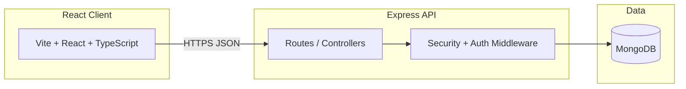

# Architecture

## Overview

## Layers

| Layer | Technology | Responsibility |
|-------|------------|----------------|
| Presentation | React 18, Tailwind, Zustand | Storefront UI, admin pages |
| API | Express, TypeScript | Auth, products, cart, checkout |
| Security | Middleware + JWT | Validation, rate limits, RBAC |
| Persistence | Mongoose / MongoDB | Users, products, orders |

## Access model

| Role | Can do |
|------|--------|
| Public | Browse catalog, search |
| Member | Profile, cart, checkout |
| Admin | Product CRUD |

## Production topology

Vercel (static client) → Railway or Fly (API) → MongoDB Atlas. Details in [deployment.md](./deployment.md).

## Repository layout

| Path | Purpose |
|------|---------|
| `client/src/pages/` | Route-level UI |
| `client/src/components/` | Shared components |
| `client/src/data/products.ts` | Mock catalog (to be replaced by API) |
| `server/src/routes/` | REST endpoints |
| `server/src/models/` | Mongoose schemas |
| `server/src/middleware/` | Auth, validation, security |
| `.github/workflows/ci.yml` | CI pipeline |

## Design note

Monolithic Express API — appropriate for current scope. Scale by adding stateless API replicas and managed MongoDB before splitting services.

## Security

- JWT auth, bcrypt passwords, request sanitization, rate limits
- Implementation: `server/src/middleware/security.ts`, `validateAuth.ts`
- Tests: `server/src/__tests__/`
